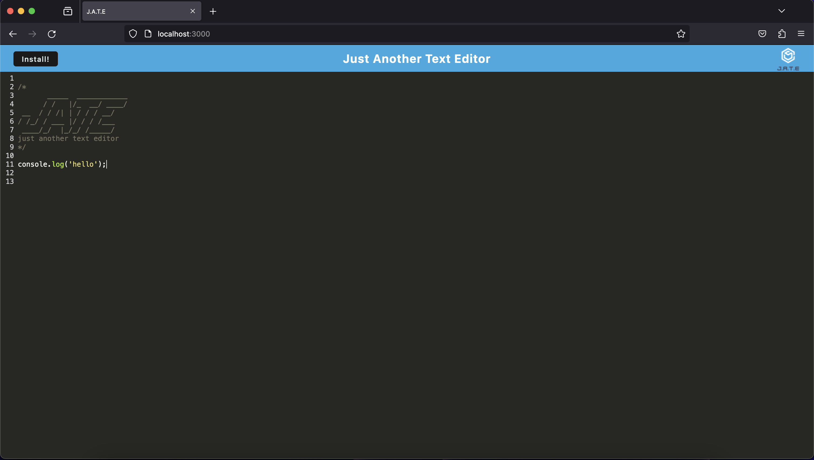

# PWA-Text-Editor

## Table of Contents 

- [Description](#description)
- [Installation(Optional)](#installation(optional))
- [Usage](#usage)
- [Credits](#credits)
- [License](#License)
- [How to Contribute](#how-to-contribute)

## Description

This application is a Progressive Web Application called Just Another Text Editor (J.A.T.E.), a text editor that runs in your browser. Given starter code, IndexedDB was used to implement get and store methods. The npm package, idb, was used to wrap the IndexedDB API. This app can be used to create notes and code snippets with or without internet connection.

## Installation(Optional)

1. Clone the repository to you local IDE.

2. Run ```npm install``` in your local IDE terminal to install the required dependencies.

3. Run ```npm run build``` to build the client.

4. Run ```npm run start``` to start the client/server.

## Usage

If you do not want to install to your local machine, check out the deployed application [here]().



## License


## Credits

Stater code [here](https://github.com/coding-boot-camp/cautious-meme).

Badges used can found [here](https://github.com/Ileriayo/markdown-badges).

## How to Contribute

Please contact me via my [Github](https://github.com/Kiararj) if you would like to contribute. 